# 🎯 Awesome Visual Regression Testing & UI Validation

<p align="center">
  
</p>

<p align="center">
  <a href="https://github.com/ishandutta2007/Awesome-Awesome-Awesome"></a><a href="https://discord.gg/jc4xtF58Ve"></a>
  <a href="https://github.com/ishandutta2007/Awesome-Visual-Regression-Testing/stargazers"></a>
  <a href="https://github.com/ishandutta2007/Awesome-Visual-Regression-Testing/network/members"></a>
  <a href="https://github.com/ishandutta2007/Awesome-Visual-Regression-Testing/blob/main/LICENSE"></a>
  <a href="https://github.com/ishandutta2007/Awesome-Visual-Regression-Testing/pulls"></a>
  <a href="https://github.com/ishandutta2007"></a>
</p>

---

## 🌟 Overview

> A curated list of **SaaS products**, **open-source frameworks**, **pixel-diff engines**, and **automated visual QA tools** for **Visual Regression Testing**, **UI Testing**, **Screenshot Diffing**, **Component Validation**, and **Cross-Browser Verification**.

Whether you are building design systems in **Storybook**, running end-to-end browser tests in **Playwright** / **Cypress**, or integrating automated visual checks into your **CI/CD pipelines**, this guide covers both enterprise SaaS platforms and developer-first open-source libraries.

---

## 📑 Table of Contents

- [☁️ SaaS & Hosted Visual Testing Platforms](#️-saashosted-visual-testing-platforms)
- [💻 Open-Source GitHub Projects](#-open-source-github-projects)
- [🧩 Specialized Open-Source Libraries](#-specialized-open-source-libraries)
- [🏗️ Visual Regression Architecture](#️-visual-regression-architecture)
- [⚖️ Open Source vs. SaaS Comparison](#️-open-source-vs-saas-comparison)
- [🤝 How to Contribute](#-how-to-contribute)
- [📈 Star History](#-star-history)
- [📜 Disclaimer & License](#-disclaimer--license)

---

## ☁️ SaaS/Hosted Visual Testing Platforms

Enterprise visual testing platforms provide cloud rendering infrastructure, cross-browser baselines, AI-driven visual diffing, and seamless PR review workflows.

> **Sorted by Company Size / Valuation (Descending)**

| 🏢 Product | 📊 Company Size (Valuation / Revenue) | 📝 Description | 💳 Pricing (Starting Tier) | 🎁 Free Tier / Free Trial Limits |
| :--- | :--- | :--- | :--- | :--- |
| **[Percy](https://percy.io/)** *(BrowserStack)* | **~$4.0 Billion** Valuation<br>*(~$225M–$380M+ ARR)* | Enterprise all-in-one visual review platform rendering snapshots across browsers and responsive viewports in CI/CD. | **$599 / month**<br>*(Entry paid tier with custom volume scaling)* | **Free forever**: 5,000 screenshots/month with unlimited users and projects |
| **[SmartBear VisualTest](https://smartbear.com/visualtest/)** | **~$1.8B – $2.0B** Valuation<br>*(~$150M+ ARR)* | Automated visual regression testing across browsers and viewports with automated baseline updates and SmartBear cloud integration. | **$143 / month**<br>*(Standard plan billed annually, 2,000 screenshots/mo)* | **Free forever**: 100 screenshots/month, 7-day test run history, unlimited users; 14-day free trial |
| **[LambdaTest SmartUI](https://www.lambdatest.com/smartui)** | **~$400 Million** Valuation<br>*(~$120M ARR)* | Cloud-based visual regression platform providing pixel-by-pixel & AI comparisons across 3000+ browser/OS combinations. | **$269 / month**<br>*(Per parallel test session; automation bundles from $79/mo)* | **Free forever (Lite)**: Access with limited monthly visual screenshot tests; 15-day free trial on paid plans |
| **[Applitools](https://applitools.com/)** | **~$250 Million** Valuation<br>*(Acquired by Thoma Bravo, ~$30M+ ARR)* | Enterprise-grade Visual AI testing platform detecting functional and visual UI anomalies across devices and viewports. | **$500 / month**<br>*(Estimated entry Starter annual tier based on Test Units)* | **Free forever**: 100 visual checkpoints/month with unlimited users; 14-day free trial (50 Test Units) |
| **[Sauce Labs Visual](https://saucelabs.com/)** | **~$200M+** Total Funding<br>*(~$92M ARR)* | Enterprise automated visual validation integrated into Sauce Labs cross-browser/device testing cloud. | **$149 / month**<br>*(Virtual Device Cloud base; Visual Testing sold via custom enterprise add-on)* | **Free trial**: 28-day free trial with 2,000 automated testing minutes *(Visual access on demo request)* |
| **[Cypress Cloud](https://www.cypress.io/)** | **~$120M+** Total Funding<br>*(~$17.8M ARR)* | Test orchestration and visual review layer integrating with Cypress end-to-end and component tests. | **$75 / month**<br>*(Team plan, $67/mo billed annually with flake detection & CI parallelization)* | **Free forever (Starter)**: 500 test results/month for up to 50 users; 30-day free trial of Team plan |
| **[Chromatic](https://www.chromatic.com/)** | **~$30M – $50M** Est. Valuation<br>*(~$5.6M ARR, Bootstrapped)* | Visual testing & UI review platform created by Storybook maintainers for web components and pages. | **$179 / month**<br>*(Starter plan, 35,000 snapshots/month, all browsers)* | **Free forever**: 5,000 snapshots/month *(Chrome only, unlimited projects & collaborators)* |
| **[Argos](https://argos-ci.com/)** | **~$5M – $10M** Est. Valuation<br>*(Venture-backed / Seed)* | Fast visual regression testing platform with seamless Git/CI integrations, GitHub/GitLab PR reviews, and Slack/Teams alerts. | **$100 / month**<br>*(Pro plan, 35,000 screenshots/month, $0.004/extra snapshot)* | **Free forever (Hobby)**: 5,000 screenshots/month, 30-day retention; 14-day free trial of Pro plan |
| **[Happo](https://happo.io/)** | **~$1M – $3M** Est. Revenue<br>*(Bootstrapped / Independent)* | Cross-browser visual regression testing tool for component libraries, design systems, and full web pages. | **$149 / month**<br>*(Starter plan, 50,000 snapshots/month, API access, unlimited users)* | **Free forever**: 5,000 snapshots/month *(Chrome browser, visual & a11y testing included)* |
| **[Wopee.io](https://wopee.io/)** | **~$2M – $4M** Est. Valuation<br>*(~$550k Pre-seed funding)* | Autonomous visual validation and self-healing UI testing platform powered by AI agents. | **€19 / user / month**<br>*(Starter plan, up to 10 projects, 150 test steps/session)* | **Free forever**: AI test execution *(~15–30 steps per 5-hour session window)*; 14-day trial guarantee |
| **[Lost Pixel Cloud](https://lost-pixel.com/)** | **Acquired by Figma**<br>*(Figma ~$12.5B parent company)* | Hosted visual regression platform for Storybook, Ladle, and web pages *(SaaS sunset; core engine is open-source)*. | **$100 / month**<br>*(Historical Startup tier for 40k screenshots before acquisition)* | **Free forever**: Core CLI/engine is 100% free open source; historical cloud tier included 7,000 screenshots/mo |

---

## 💻 Open-Source GitHub Projects

Open-source visual regression testing tools, screenshot runners, and image comparison libraries.

> **Sorted by GitHub Stars (Descending)**

* **[Puppeteer](https://github.com/puppeteer/puppeteer)** [](https://github.com/puppeteer/puppeteer/stargazers)  
  ⚡ Node library providing a high-level API over headless Chrome/Chromium for visual snapshots and deterministic browser automation.

* **[Playwright](https://github.com/microsoft/playwright)** [](https://github.com/microsoft/playwright/stargazers)  
  🎭 Fast and reliable cross-browser automation framework with built-in visual comparison via `toHaveScreenshot()` and snapshot assertions.

* **[Storybook](https://github.com/storybookjs/storybook)** [](https://github.com/storybookjs/storybook/stargazers)  
  📕 Industry-standard frontend component workshop environment providing the foundation for UI component visual regression testing.

* **[Cypress](https://github.com/cypress-io/cypress)** [](https://github.com/cypress-io/cypress/stargazers)  
  🌲 Fast, easy, and reliable end-to-end and component testing framework extensible with visual regression diffing plugins.

* **[Jest](https://github.com/jestjs/jest)** [](https://github.com/jestjs/jest/stargazers)  
  🃏 Delightful JavaScript testing framework featuring snapshot testing capabilities and image-diff matchers like `jest-image-snapshot`.

* **[Selenium](https://github.com/SeleniumHQ/selenium)** [](https://github.com/SeleniumHQ/selenium/stargazers)  
  🌐 Ubiquitous browser automation ecosystem widely combined with image comparison engines to create custom visual QA pipelines.

* **[Vitest](https://github.com/vitest-dev/vitest)** [](https://github.com/vitest-dev/vitest/stargazers)  
  ⚡ Blazing fast Vite-native unit and component test framework with first-class snapshot testing capabilities.

* **[Nightwatch.js](https://github.com/nightwatchjs/nightwatch)** [](https://github.com/nightwatchjs/nightwatch/stargazers)  
  🦉 Integrated end-to-end and component testing framework powered by Node.js and W3C WebDriver with visual regression support.

* **[WebdriverIO](https://github.com/webdriverio/webdriverio)** [](https://github.com/webdriverio/webdriverio/stargazers)  
  🚀 Next-gen browser and mobile automation test framework with dedicated visual regression testing services and image comparison plugins.

* **[BackstopJS](https://github.com/garris/BackstopJS)** [](https://github.com/garris/BackstopJS/stargazers)  
  📸 Leading dedicated visual regression testing framework automating screenshot capture, diffing, interactive reports, and approval in CI.

* **[pixelmatch](https://github.com/mapbox/pixelmatch)** [](https://github.com/mapbox/pixelmatch/stargazers)  
  🔬 Small, lightweight, and ultra-fast pixel-level image comparison library in pure JavaScript (the engine behind many diff tools).

* **[Wraith](https://github.com/bbc/wraith)** [](https://github.com/bbc/wraith/stargazers)  
  👻 Responsive screenshot comparison tool developed by BBC News to compare domains across multiple screen resolutions.

* **[Resemble.js](https://github.com/rsmbl/Resemble.js)** [](https://github.com/rsmbl/Resemble.js/stargazers)  
  🎨 Image analysis and comparison tool for Node.js and browser environments with perceptual diffing algorithms.

* **[jest-image-snapshot](https://github.com/americanexpress/jest-image-snapshot)** [](https://github.com/americanexpress/jest-image-snapshot/stargazers)  
  💳 Jest matcher for visual regression testing by American Express, seamlessly integrating screenshot diffing into Jest test suites.

* **[jest-puppeteer](https://github.com/argos-ci/jest-puppeteer)** [](https://github.com/argos-ci/jest-puppeteer/stargazers)  
  🤖 Jest runner for Puppeteer providing global browser setup and screenshot capture helpers for visual regression testing.

* **[QA Wolf](https://github.com/qawolf/qawolf)** [](https://github.com/qawolf/qawolf/stargazers)  
  🐺 Automated end-to-end testing platform built on Playwright with visual verification and test-generation capabilities.

* **[odiff](https://github.com/dmtrKovalenko/odiff)** [](https://github.com/dmtrKovalenko/odiff/stargazers)  
  ⚡ The fastest pixel-by-pixel image visual diffing tool in the world, written in SIMD-accelerated native code.

* **[Loki](https://github.com/oblador/loki)** [](https://github.com/oblador/loki/stargazers)  
  🎯 Zero-configuration visual regression testing tool designed specifically for Storybook components.

* **[Lost Pixel](https://github.com/lost-pixel/lost-pixel)** [](https://github.com/lost-pixel/lost-pixel/stargazers)  
  🧩 Holistic open-source visual regression engine for Storybook, Ladle, Histoire, Next.js, and static screenshots in CI.

* **[Gemini](https://github.com/gemini-testing/gemini)** [](https://github.com/gemini-testing/gemini/stargazers)  
  ♊ Utility for regression testing web page appearance with automated screenshot capture and baseline management.

* **[Galen Framework](https://github.com/galenframework/galen)** [](https://github.com/galenframework/galen/stargazers)  
  📐 Automated testing framework focused on validating web layouts, responsive design rules, and visual specifications.

* **[reg-suit](https://github.com/reg-viz/reg-suit)** [](https://github.com/reg-viz/reg-suit/stargazers)  
  👔 Extensible visual regression testing toolkit that compares images, generates HTML diff reports, and stores baselines in S3/GCS.

* **[Hermione](https://github.com/gemini-testing/hermione)** [](https://github.com/gemini-testing/hermione/stargazers)  
  🪄 Browser test runner based on WebdriverIO and Mocha with built-in visual regression and screenshot comparison plugins.

* **[looks-same](https://github.com/gemini-testing/looks-same)** [](https://github.com/gemini-testing/looks-same/stargazers)  
  🔍 High-accuracy Node.js library for comparing images and detecting visual diffs while intelligently ignoring antialiasing artifacts.

* **[Visual Regression Tracker](https://github.com/Visual-Regression-Tracker/Visual-Regression-Tracker)** [](https://github.com/Visual-Regression-Tracker/Visual-Regression-Tracker/stargazers)  
  📊 Open-source self-hostable backend and frontend solution for tracking, reviewing, and approving visual testing baselines in CI.

* **[Differencify](https://github.com/NimaSoroush/differencify)** [](https://github.com/NimaSoroush/differencify/stargazers)  
  🔍 Visual regression testing tool leveraging Chrome and Puppeteer with async/await APIs and Jest integration.

* **[Needle](https://github.com/python-needle/needle)** [](https://github.com/python-needle/needle/stargazers)  
  🐍 Python visual-testing library for taking screenshots of web elements and comparing them with approved baselines using Selenium.

* **[Percy CLI](https://github.com/percy/cli)** [](https://github.com/percy/cli/stargazers)  
  💻 Command-line tool and agent for capturing DOM snapshots and communicating with the Percy visual testing platform.

---

## 🧩 Specialized Open-Source Libraries

### 🔍 Image Diffing Engines
* **[pixelmatch](https://github.com/mapbox/pixelmatch)** — Pure JavaScript pixel comparison with antialiasing detection.
* **[odiff](https://github.com/dmtrKovalenko/odiff)** — Native SIMD-accelerated pixel difference generator.
* **[looks-same](https://github.com/gemini-testing/looks-same)** — Node.js image comparison with color tolerance and antialiasing exclusion.
* **[Resemble.js](https://github.com/rsmbl/Resemble.js)** — Perceptual image analysis and diff highlight engine.

### 📕 Component & Storybook Testing
* **[Storybook](https://github.com/storybookjs/storybook)** — UI component workshop environment.
* **[Loki](https://github.com/oblador/loki)** — Zero-config component visual testing for Storybook.
* **[Lost Pixel](https://github.com/lost-pixel/lost-pixel)** — Visual regression engine supporting Storybook, Ladle, and Histoire.

### 🌐 Test Framework Matchers & Plugins
* **[jest-image-snapshot](https://github.com/americanexpress/jest-image-snapshot)** — Jest image assertions.
* **[Playwright toHaveScreenshot](https://github.com/microsoft/playwright)** — Native Playwright screenshot assertions.
* **[reg-suit](https://github.com/reg-viz/reg-suit)** — CI visual pipeline with cloud bucket baseline management.
* **[Visual Regression Tracker](https://github.com/Visual-Regression-Tracker/Visual-Regression-Tracker)** — Self-hosted baseline review UI.

---

## 🏗️ Visual Regression Architecture

A typical automated visual testing pipeline follows this workflow:

```
┌─────────────────┐       ┌─────────────────┐       ┌─────────────────┐
│ 1. Render App / │ ───>  │ 2. Capture View │ ───>  │ 3. Compare with │
│   UI Component  │       │  Screenshots    │       │   Baseline      │
└─────────────────┘       └─────────────────┘       └─────────────────┘
                                                             │
                                                             ▼
┌─────────────────┐       ┌─────────────────┐       ┌─────────────────┐
│ 6. Fail/Pass CI │ <───  │ 5. Review Diff  │ <───  │ 4. Compute Diff │
│   & Merge PR    │       │  & Baseline     │       │   & Tolerance   │
└─────────────────┘       └─────────────────┘       └─────────────────┘
```

### Core Pipeline Formulas:
* **Component Testing Stack**: `Storybook → Loki / Lost Pixel → Browser Rendering → Screenshot → Diff Engine → Approval`
* **End-to-End Testing Stack**: `Playwright / Cypress → Viewport Capture → pixelmatch / odiff → HTML Report → CI/CD`
* **Self-Hosted Enterprise Stack**: `Browser Runner → S3 Baseline Storage → Visual Regression Tracker UI → PR Check`

---

## ⚖️ Open Source vs. SaaS Comparison

| ⚙️ Capability | 💻 Open Source | ☁️ SaaS / Hosted |
| :--- | :---: | :---: |
| **Screenshot comparison** | ✅ Built-in | ✅ Built-in |
| **Baseline management** | 🛠️ DIY (S3 / Git / Local) | ✅ Managed Cloud Storage |
| **CI/CD integration** | ✅ Configurable | ✅ Native Integrations |
| **Self-hosting & Data privacy** | 🛡️ 100% On-Premise Control | 🏢 Vendor Managed Cloud |
| **PR & Collaboration UI** | ⚠️ Varies / Basic HTML | 🌟 Rich Multi-User Review UI |
| **Cross-browser infrastructure** | 🛠️ Bring Your Own Grid | 🌐 Built-in Cross-Browser Grid |
| **Visual AI / Layout Smart Diff** | ❌ Mostly Pixel Diffing | 🤖 Advanced Visual AI Engines |
| **Maintenance overhead** | 🔧 Higher (Grid & Storage) | ⚡ Low (Turnkey Solution) |
| **Pricing Model** | 🆓 Free (Infra Costs) | 💳 Subscription / Usage-Based |

---

## 🤝 How to Contribute

Contributions are warmly welcomed! 💖

1. 🍴 **Fork** the repository.
2. 🌿 **Create** your feature branch: `git checkout -b feature/awesome-entry`.
3. 📝 **Add/edit** entries in `README.md` following the existing format:
   - For SaaS tools: include Company Size, Description, Specific Starting Price, and Specific Free Tier/Trial limits.
   - For Open-Source repos: include repo link, description, and social star badge linked to stargazers.
4. 🚀 **Commit** your changes: `git commit -m "Add [Tool Name] to visual regression testing list"`.
5. 📬 **Submit** a Pull Request with a clear summary of your addition.

⭐ **Star the repo** if you find it helpful!

---

## 📈 Star History

[](https://star-history.dera.page/#ishandutta2007/Awesome-Visual-Regression-Testing&type=date&legend=top-left)

---

## 📜 Disclaimer & License

* This repository is a **community-curated** list for educational and informational purposes.
* Trademarks and product names are property of their respective owners.
* Licensed under the [MIT License](LICENSE).

---

<p align="center">
  <b>Made with ❤️ for Frontend Engineers, QA Teams, DevOps, and Open-Source Developers.</b><br>
  <i>Let's make automated visual testing reliable, fast, and accessible for everyone!</i>
</p>
